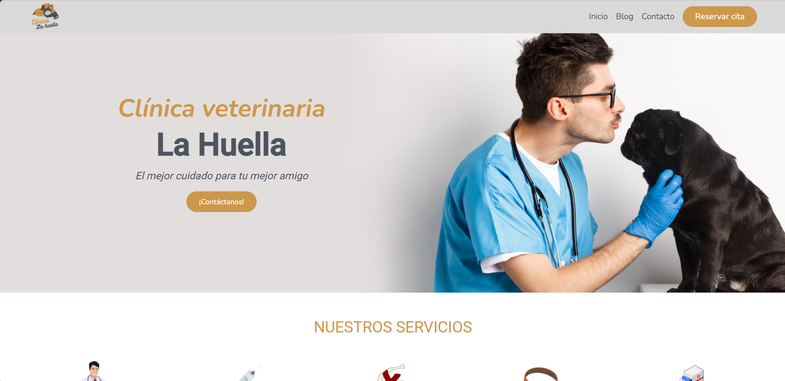

# Clínica La Huella

Clínica La Huella es una web hecha con Angular SSR sobre una clínica veterinaria ficticia. El proyecto hace especial hincapié en Server Side Rendering y el SEO amigable.

## Características del proyecto

- Sitio web hecho con Angular SSR con SEO amigable.
- Panel de administración para la clínica.
- Reservas para consultas y citas flexibles con calendario.
- Envío de email con Gmail API al confirmar una cita.
- Google Analytics para las métricas.
- Suscripciones a la newsletter.
- Formulario de contacto.
- Gestión de blog.
- Chat con Gemini IA integrado en el panel de administración.

## Diseño



Diseño realizado en Figma. Para ver el diseño completo, haz clic <a href="https://www.figma.com/design/LsuXa2O8Y0vWcQDWlzBIlg/Cl%C3%ADnica-veterinaria?m=auto&t=T4pKS07hZqb7ry0L-1">aquí</a>.

## Requisitos

Para utilizar esta aplicación necesitas tener instalado lo siguiente: 

**Angular:** v18.2.11  
**Node.js:** v20.13.1 o superior.  
**NVM** (Recomendable)

## Instalación

1. Clona el repositorio.

```bash
  git clone https://github.com/Juanlu3095/clinicalahuella.git
```
2. Instala las dependencias.

```bash
  npm install
```
3. Configura las variables de entorno.

- Edita el archivo environment correspondiente.
- apiendpoint para el endpoint de la API para el backend.
- FilesEndpoint si vas a usar el disco local para el almacenamiento.
- DriveEndPoint para usar almacenamiento de Drive.

4. Ejecuta la aplicación.

```bash
  ng serve
```

o si quieres que se abra directamente una ventana en tu navegador: 

```bash
  ng serve --o
```

## Testing

La aplicación web utiliza karma y jasmine para las pruebas unitarias. Para ejecutar todos los tests:

```bash
  ng test
```

o para ejecuta uno en concreto:

```bash
  npm run test:url --url=[url]
```
donde [url] es la url del .spec desde 'src/app'.

## Documentación

Para ver la documentación de la aplicación haz clic <a href="https://drive.google.com/file/d/1YsyizaXtn3pvTXsNxCqhE_TFZQihNGDB/view?usp=drive_link">aquí</a>.